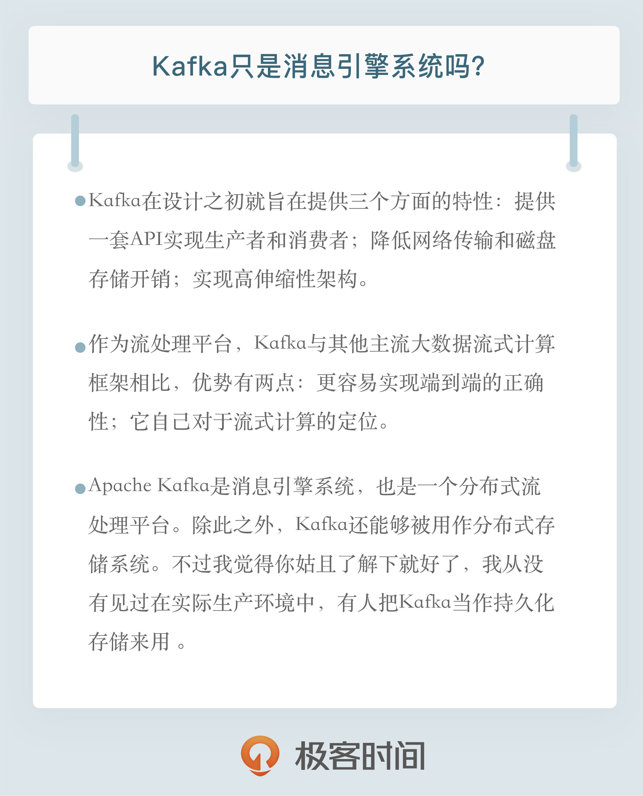

# 03 | Kafka只是消息引擎系统吗？

**有的时候我们会觉得说了解一个系统或框架的前世今生似乎没什么必要，直接开始学具体的技术不是更快更好吗？其实，不论是学习哪种技术，直接扎到具体的细节中，亦或是从一个很小的点开始学习，你很快就会感到厌烦。为什么呢？因为你虽然快速地搞定了某个技术细节，但无法建立全局的认知观，这会导致你只是在单个的点上有所进展，却没法将其串联成一条线进而扩展成一个面，从而实现系统地学习。**

这个问题的答案是，**Apache Kafka 是消息引擎系统，也是一个分布式流处理平台（Distributed Streaming Platform）**。如果你通读全篇文字但只能记住一句话，我希望你记住的就是这句。再强调一遍，Kafka 是消息引擎系统，也是分布式流处理平台。

众所周知，Kafka 是 LinkedIn 公司内部孵化的项目。根据我和 Kafka 创始团队成员的交流以及查阅到的公开信息显示，LinkedIn 最开始有强烈的数据强实时处理方面的需求，其内部的诸多子系统要执行多种类型的数据处理与分析，主要包括业务系统和应用程序性能监控，以及用户行为数据处理等。

当时他们碰到的主要问题包括：

+ 数据正确性不足。因为数据的收集主要采用轮询（Polling）的方式，如何确定轮询的间隔时间就变成了一个高度经验化的事情。虽然可以采用一些类似于启发式算法（Heuristic）来帮助评估间隔时间值，但一旦指定不当，必然会造成较大的数据偏差。
+ **系统高度定制化，维护成本高。各个业务子系统都需要对接数据收集模块，引入了大量的定制开销和人工成本。**

言归正传，Kafka 在设计之初就旨在提供三个方面的特性：

+ 提供一套 API 实现生产者和消费者；
+ 降低网络传输和磁盘存储开销；
+ 实现高伸缩性架构。
  
开源之后的 Kafka 被越来越多的公司应用到它们企业内部的数据管道中，特别是在大数据工程领域，Kafka 在承接上下游、串联数据流管道方面发挥了重要的作用：所有的数据几乎都要从一个系统流入 Kafka 然后再流向下游的另一个系统中。这样的使用方式屡见不鲜以至于引发了 Kafka 社区的思考：与其我把数据从一个系统传递到下一个系统中做处理，我为何不自己实现一套流处理框架呢？基于这个考量，Kafka 社区于 0.10.0.0 版本正式推出了流处理组件 Kafka Streams，也正是从这个版本开始，Kafka 正式“变身”为分布式的流处理平台，而不仅仅是消息引擎系统了。**今天 Apache Kafka 是和 Apache Storm、Apache Spark 和 Apache Flink 同等级的实时流处理平台。**

你可能会有这样的疑问：作为流处理平台，Kafka 与其他主流大数据流式计算框架相比，优势在哪里呢？我能想到的有两点。

1. 第一点是更容易实现端到端的正确性（Correctness）。Google 大神 Tyler 曾经说过，流处理要最终替代它的“兄弟”批处理需要具备两点核心优势：**要实现正确性和提供能够推导时间的工具。**实现正确性是流处理能够匹敌批处理的基石。正确性一直是批处理的强项，而实现正确性的基石则是要求框架能提供精确一次处理语义，即处理一条消息有且只有一次机会能够影响系统状态。**目前主流的大数据流处理框架都宣称实现了精确一次处理语义，但这是有限定条件的，即它们只能实现框架内的精确一次处理语义，无法实现端到端的。**这是为什么呢？因为当这些框架与外部消息引擎系统结合使用时，它们无法影响到外部系统的处理语义，所以如果你搭建了一套环境使得 Spark 或 Flink 从 Kafka 读取消息之后进行有状态的数据计算，最后再写回 Kafka，那么你只能保证在 Spark 或 Flink 内部，这条消息对于状态的影响只有一次。但是计算结果有可能多次写入到 Kafka，因为它们不能控制 Kafka 的语义处理。**相反地，Kafka 则不是这样，因为所有的数据流转和计算都在 Kafka 内部完成，故 Kafka 可以实现端到端的精确一次处理语义。**

2. 可能助力 Kafka 胜出的第二点是它自己对于流式计算的定位。**官网上明确标识 Kafka Streams 是一个用于搭建实时流处理的客户端库而非是一个完整的功能系统。**这就是说，你不能期望着 Kafka 提供类似于集群调度、弹性部署等开箱即用的运维特性，你需要自己选择适合的工具或系统来帮助 Kafka 流处理应用实现这些功能。读到这你可能会说这怎么算是优点呢？坦率来说，这的确是一个“双刃剑”的设计，也是 Kafka 社区“剑走偏锋”不正面 PK 其他流计算框架的特意考量。**大型公司的流处理平台一定是大规模部署的，因此具备集群调度功能以及灵活的部署方案是不可或缺的要素。**但毕竟这世界上还存在着很多中小企业，它们的流处理数据量并不巨大，逻辑也并不复杂，部署几台或十几台机器足以应付。在这样的需求之下，搭建重量级的完整性平台实在是“杀鸡焉用牛刀”，而这正是 Kafka 流处理组件的用武之地。因此从这个角度来说，未来在流处理框架中，Kafka 应该是有一席之地的。

除了消息引擎和流处理平台，Kafka 还有别的用途吗？当然有！你能想象吗，Kafka 能够被用作分布式存储系统。Kafka 作者之一 Jay Kreps 曾经专门写过一篇文章阐述为什么能把Kafka 用作分布式存储。不过我觉得你姑且了解下就好了，我从没有见过在实际生产环境中，有人把 Kafka 当作持久化存储来用 。

说了这么多，我只想阐述这样的一个观点：**Apache Kafka 从一个优秀的消息引擎系统起家，逐渐演变成现在分布式的流处理平台。你不仅要熟练掌握它作为消息引擎系统的非凡特性及使用技巧，最好还要多了解下其流处理组件的设计与案例应用。**

推荐大家去搜索一个Confluence的演讲，题目是ETL is dead，其中讲到了Kafka在流处理平台的来龙去脉