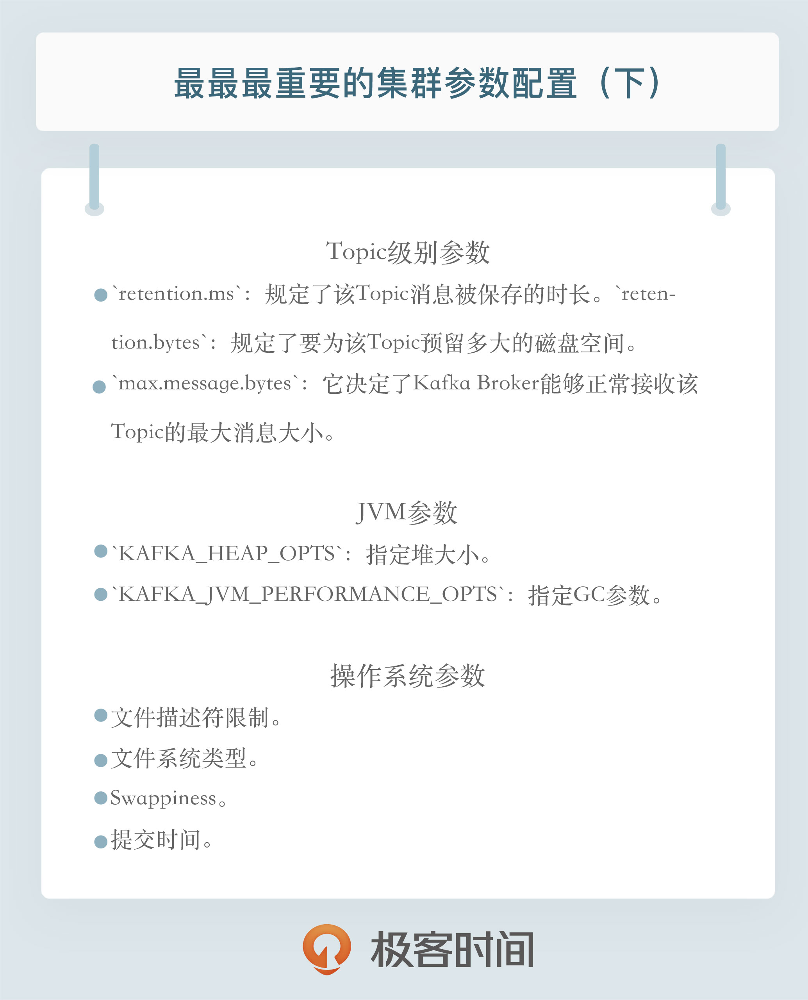

# 08 | 最最最重要的集群参数配置（下）

今天我们继续来聊那些重要的 Kafka 集群配置，下半部分主要是 Topic 级别参数、JVM 参数以及操作系统参数的设置。

在上一期中，我们讨论了 Broker 端参数设置的一些法则，但其实 Kafka 也支持为不同的 Topic 设置不同的参数值。当前最新的 2.2 版本总共提供了大约 25 个 Topic 级别的参数，当然我们也不必全部了解它们的作用，这里我挑出了一些最关键的参数，你一定要把它们掌握清楚。除了 Topic 级别的参数，我今天还会给出一些重要的 JVM 参数和操作系统参数，正确设置这些参数是搭建高性能 Kafka 集群的关键因素。

## Topic 级别参数

说起 Topic 级别的参数，你可能会有这样的疑问：如果同时设置了 Topic 级别参数和全局 Broker 参数，到底听谁的呢？哪个说了算呢？答案就是 Topic 级别参数会覆盖全局 Broker 参数的值，而每个 Topic 都能设置自己的参数值，这就是所谓的 Topic 级别参数。

举个例子说明一下，上一期我提到了消息数据的留存时间参数，在实际生产环境中，如果为所有 Topic 的数据都保存相当长的时间，这样做既不高效也无必要。更适当的做法是允许不同部门的 Topic 根据自身业务需要，设置自己的留存时间。如果只能设置全局 Broker 参数，那么势必要提取所有业务留存时间的最大值作为全局参数值，此时设置 Topic 级别参数把它覆盖，就是一个不错的选择。

下面我们依然按照用途分组的方式引出重要的 Topic 级别参数。从保存消息方面来考量的话，下面这组参数是非常重要的：

+ retention.ms：规定了该 Topic 消息被保存的时长。默认是 7 天，即该 Topic 只保存最近 7 天的消息。一旦设置了这个值，它会覆盖掉 Broker 端的全局参数值。
+ retention.bytes：规定了要为该 Topic 预留多大的磁盘空间。和全局参数作用相似，这个值通常在多租户的 Kafka 集群中会有用武之地。当前默认值是 -1，表示可以无限使用磁盘空间。

上面这些是从保存消息的维度来说的。如果从能处理的消息大小这个角度来看的话，有一个参数是必须要设置的，即max.message.bytes。它决定了 Kafka Broker 能够正常接收该 Topic 的最大消息大小。我知道目前在很多公司都把 Kafka 作为一个基础架构组件来运行，上面跑了很多的业务数据。如果在全局层面上，我们不好给出一个合适的最大消息值，那么不同业务部门能够自行设定这个 Topic 级别参数就显得非常必要了。在实际场景中，这种用法也确实是非常常见的。

好了，你要掌握的 Topic 级别的参数就这么几个。下面我来说说怎么设置 Topic 级别参数吧。其实说到这个事情，我是有点个人看法的：我本人不太赞同那种做一件事情开放给你很多种选择的设计方式，看上去好似给用户多种选择，但实际上只会增加用户的学习成本。特别是系统配置，如果你告诉我只能用一种办法来做，我会很努力地把它学会；反之，如果你告诉我说有两种方法甚至是多种方法都可以实现，那么我可能连学习任何一种方法的兴趣都没有了。Topic 级别参数的设置就是这种情况，我们有两种方式可以设置：

+ 创建 Topic 时进行设置
+ 修改 Topic 时设置

我们先来看看如何在创建 Topic 时设置这些参数。我用上面提到的retention.ms和max.message.bytes举例。设想你的部门需要将交易数据发送到 Kafka 进行处理，需要保存最近半年的交易数据，同时这些数据很大，通常都有几 MB，但一般不会超过 5MB。现在让我们用以下命令来创建 Topic：

```shell

bin/kafka-topics.sh --bootstrap-server localhost:9092 --create --topic transaction --partitions 1 --replication-factor 1 --config retention.ms=15552000000 --config max.message.bytes=5242880
```

我们只需要知道 Kafka 开放了kafka-topics命令供我们来创建 Topic 即可。对于上面这样一条命令，请注意结尾处的--config设置，我们就是在 config 后面指定了想要设置的 Topic 级别参数。

下面看看使用另一个自带的命令kafka-configs来修改 Topic 级别参数。假设我们现在要发送最大值是 10MB 的消息，该如何修改呢？命令如下：

```shell

bin/kafka-configs.sh --zookeeper localhost:2181 --entity-type topics --entity-name transaction --alter --add-config max.message.bytes=10485760
```

总体来说，你只能使用这么两种方式来设置 Topic 级别参数。我个人的建议是，你最好始终坚持使用第二种方式来设置，并且在未来，Kafka 社区很有可能统一使用kafka-configs脚本来调整 Topic 级别参数。

## JVM 参数

首先我先说说 Java 版本，我个人极其不推荐将 Kafka 运行在 Java 6 或 7 的环境上。Java 6 实在是太过陈旧了，没有理由不升级到更新版本。另外 Kafka 自 2.0.0 版本开始，已经正式摒弃对 Java 7 的支持了，所以有条件的话至少使用 Java 8 吧。

说到 JVM 端设置，堆大小这个参数至关重要。虽然在后面我们还会讨论如何调优 Kafka 性能的问题，但现在我想无脑给出一个通用的建议：将你的 JVM 堆大小设置成 6GB 吧，这是目前业界比较公认的一个合理值。我见过很多人就是使用默认的 Heap Size 来跑 Kafka，说实话默认的 1GB 有点小，毕竟 Kafka Broker 在与客户端进行交互时会在 JVM 堆上创建大量的 ByteBuffer 实例，Heap Size 不能太小。

JVM 端配置的另一个重要参数就是垃圾回收器的设置，也就是平时常说的 GC 设置。如果你依然在使用 Java 7，那么可以根据以下法则选择合适的垃圾回收器：

+ 如果 Broker 所在机器的 CPU 资源非常充裕，建议使用 CMS 收集器。启用方法是指定-XX:+UseCurrentMarkSweepGC。
+ 否则，使用吞吐量收集器。开启方法是指定-XX:+UseParallelGC。

当然了，如果你在使用 Java 8，那么可以手动设置使用 G1 收集器。在没有任何调优的情况下，G1 表现得要比 CMS 出色，主要体现在更少的 Full GC，需要调整的参数更少等，所以使用 G1 就好了。

现在我们确定好了要设置的 JVM 参数，我们该如何为 Kafka 进行设置呢？有些奇怪的是，这个问题居然在 Kafka 官网没有被提及。其实设置的方法也很简单，你只需要设置下面这两个环境变量即可：

+ KAFKA_HEAP_OPTS：指定堆大小。
+ KAFKA_JVM_PERFORMANCE_OPTS：指定 GC 参数。

比如你可以这样启动 Kafka Broker，即在启动 Kafka Broker 之前，先设置上这两个环境变量：

```sh

$> export KAFKA_HEAP_OPTS=--Xms6g  --Xmx6g
$> export KAFKA_JVM_PERFORMANCE_OPTS= -server -XX:+UseG1GC -XX:MaxGCPauseMillis=20 -XX:InitiatingHeapOccupancyPercent=35 -XX:+ExplicitGCInvokesConcurrent -Djava.awt.headless=true
$> bin/kafka-server-start.sh config/server.properties
```

## 操作系统参数

最后我们来聊聊 Kafka 集群通常都需要设置哪些操作系统参数。通常情况下，Kafka 并不需要设置太多的 OS 参数，但有些因素最好还是关注一下，比如下面这几个：

+ 文件描述符限制
+ 文件系统类型
+ Swappiness
+ 提交时间

首先是ulimit -n。我觉得任何一个 Java 项目最好都调整下这个值。实际上，文件描述符系统资源并不像我们想象的那样昂贵，你不用太担心调大此值会有什么不利的影响。通常情况下将它设置成一个超大的值是合理的做法，比如ulimit -n 1000000。还记得电影《让子弹飞》里的对话吗：“你和钱，谁对我更重要？都不重要，没有你对我很重要！”。这个参数也有点这么个意思。其实设置这个参数一点都不重要，但不设置的话后果很严重，比如你会经常看到“Too many open files”的错误。

其次是文件系统类型的选择。这里所说的文件系统指的是如 ext3、ext4 或 XFS 这样的日志型文件系统。根据官网的测试报告，XFS 的性能要强于 ext4，所以生产环境最好还是使用 XFS。对了，最近有个 Kafka 使用 ZFS 的数据报告，貌似性能更加强劲，有条件的话不妨一试。

第三是 swap 的调优。网上很多文章都提到设置其为 0，将 swap 完全禁掉以防止 Kafka 进程使用 swap 空间。我个人反倒觉得还是不要设置成 0 比较好，我们可以设置成一个较小的值。为什么呢？因为一旦设置成 0，当物理内存耗尽时，操作系统会触发 OOM killer 这个组件，它会随机挑选一个进程然后 kill 掉，即根本不给用户任何的预警。但如果设置成一个比较小的值，当开始使用 swap 空间时，你至少能够观测到 Broker 性能开始出现急剧下降，从而给你进一步调优和诊断问题的时间。基于这个考虑，我个人建议将 swappniess 配置成一个接近 0 但不为 0 的值，比如 1。

最后是提交时间或者说是 Flush 落盘时间。向 Kafka 发送数据并不是真要等数据被写入磁盘才会认为成功，而是只要数据被写入到操作系统的页缓存（Page Cache）上就可以了，随后操作系统根据 LRU 算法会定期将页缓存上的“脏”数据落盘到物理磁盘上。这个定期就是由提交时间来确定的，默认是 5 秒。一般情况下我们会认为这个时间太频繁了，可以适当地增加提交间隔来降低物理磁盘的写操作。当然你可能会有这样的疑问：如果在页缓存中的数据在写入到磁盘前机器宕机了，那岂不是数据就丢失了。的确，这种情况数据确实就丢失了，但鉴于 Kafka 在软件层面已经提供了多副本的冗余机制，因此这里稍微拉大提交间隔去换取性能还是一个合理的做法。

## 小结




修改 Topic 级 max.message.bytes，还要考虑以下两个吧？
还要修改 Broker的 replica.fetch.max.bytes 保证复制正常
消费还要修改配置 fetch.message.max.bytes


ulimit -n这个参数说的太好了！如果不设置，单机在Centos7上几百的并发就报“Too many open files”了。网上搜索后设置成65535，用JMater压测单机也只能支撑到1000左右的并发，原来这个值可以设置到1000000！《Kafka权威指南》上说Kafka单机可以轻松处理300万并发；《响应式架构:消息模式Actor实现与Scala、Akka应用集成》上说Scala用Actor单机可以处理5000万并发。请问胡老师有没有推荐的Linux方面的书籍，可以详细解答ulimit -n参数、如何知道单台Linux机器可以处理的连接数上线？


